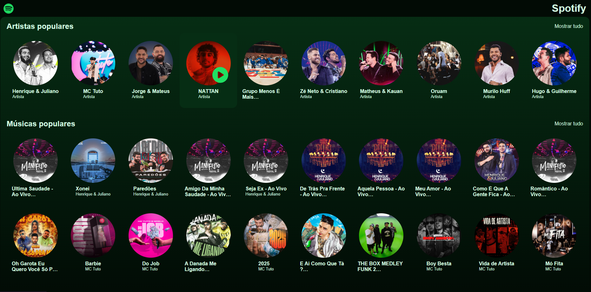
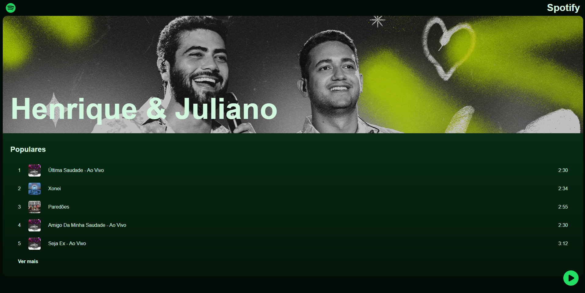
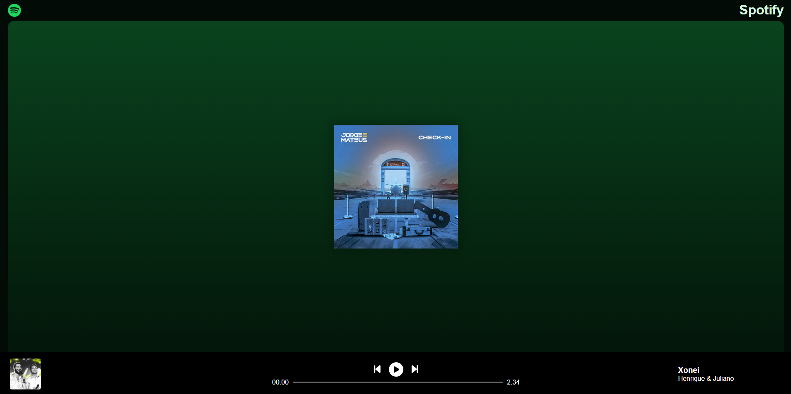

# SpotifyClone

Um clone do Spotify desenvolvido com React e JavaScript.

## 📌 Funcionalidades

- 🎵 Interface semelhante ao Spotify
- ▶️ Reprodução de músicas
- 📂 Navegação entre playlists e álbuns

## 🖥️ Interface

- Homepage
- Artistas
- Músicas







## 🤖 Tecnologias

- React
- JavaScript
- CSS
- HTML

## 📁 Estrutura do Projeto

```
SpotifyClone/
├── back-end/
│   ├── api/
│   └── package.json # Dependências e scripts do back-end
|   └── package-lock.json
├── front-end/               # Contém todo o código do front-end
│   ├── public/              # Arquivos públicos (ex.: index.html)
│   ├── src/                 # Código-fonte (componentes, assets, etc.)
│   ├── package.json         # Dependências e scripts do front-end
│   ├── package-lock.json
│   └── vite.config.js       # Configuração do Vite
├── .gitignore               # Arquivos e pastas ignorados pelo Git
├── eslint.config.js         # Configuração do ESLint
└── README.md                # Documentação do projeto
```

## 🚀 Instalação

1. Clone o repositório:

   ```bash
   git clone https://github.com/c4uan/SpotifyClone.git
   ```

2. Navegue até o diretório do projeto:

   ```bash
   cd SpotifyClone
   ```

3. Instale as dependências:
   ```bash
   npm install
   ```

## ▶️ Uso

Após a instalação, inicie o servidor de desenvolvimento:

```bash
npm run dev
```

A aplicação estará disponível em `http://localhost:3000`.

## 🤝 Contribuição

Contribuições são bem-vindas! Sinta-se à vontade para abrir issues ou enviar pull requests.

## 📜 Licença

Este projeto está licenciado sob a Licença MIT. Consulte o arquivo [LICENSE](LICENSE) para mais informações.
